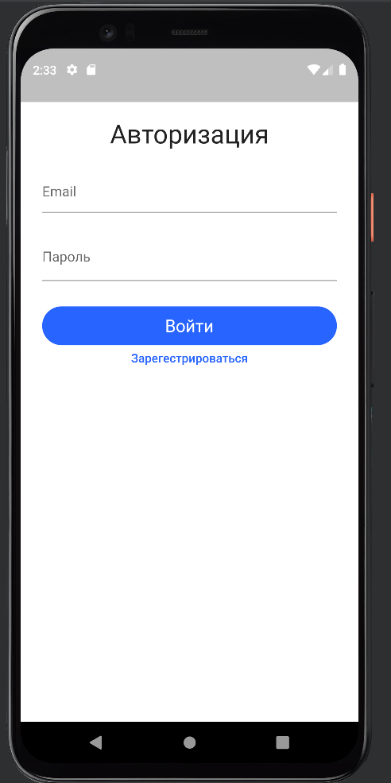
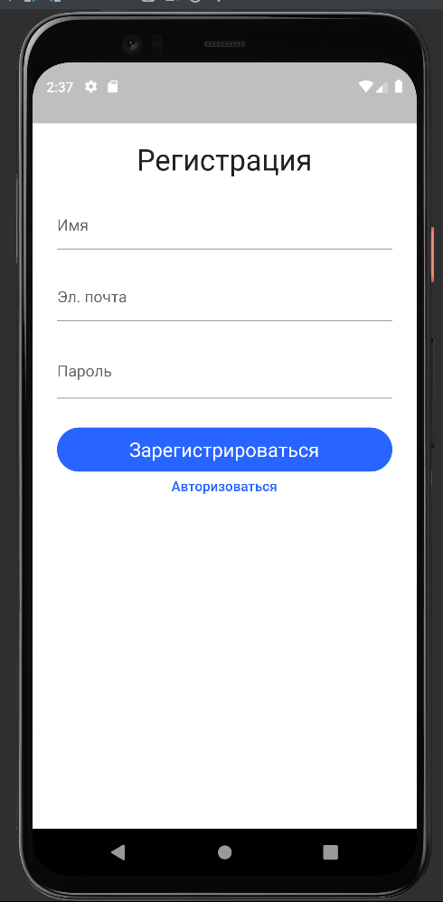
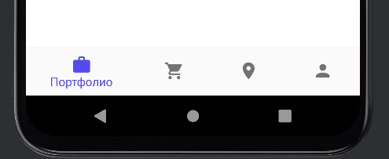
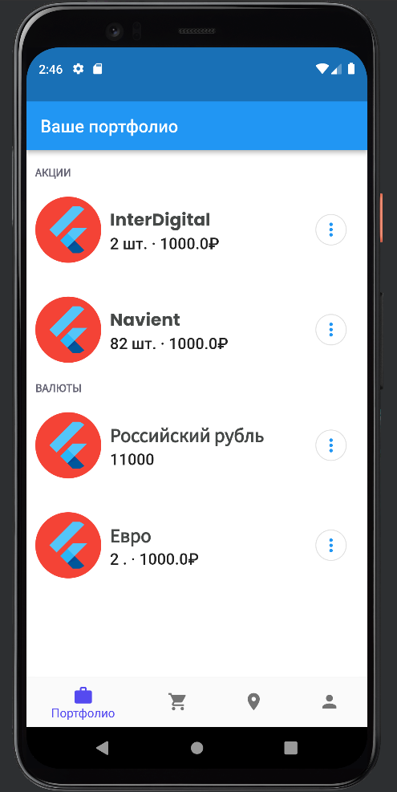
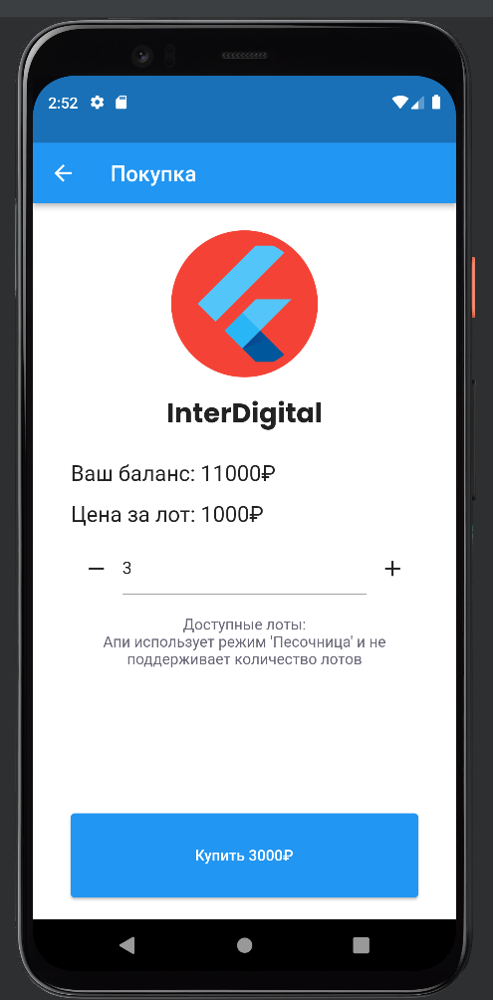
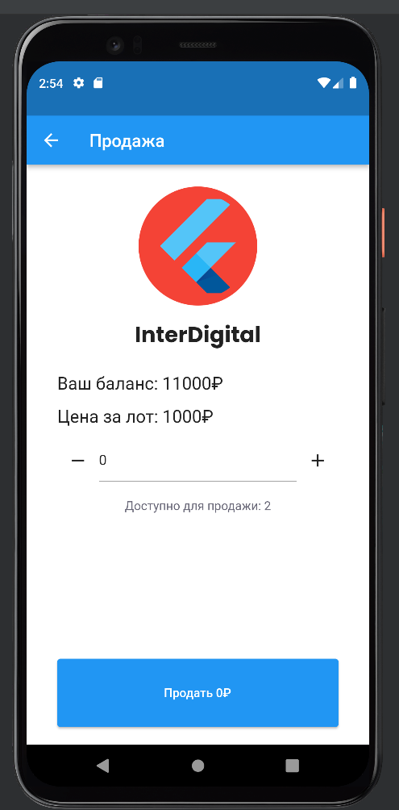
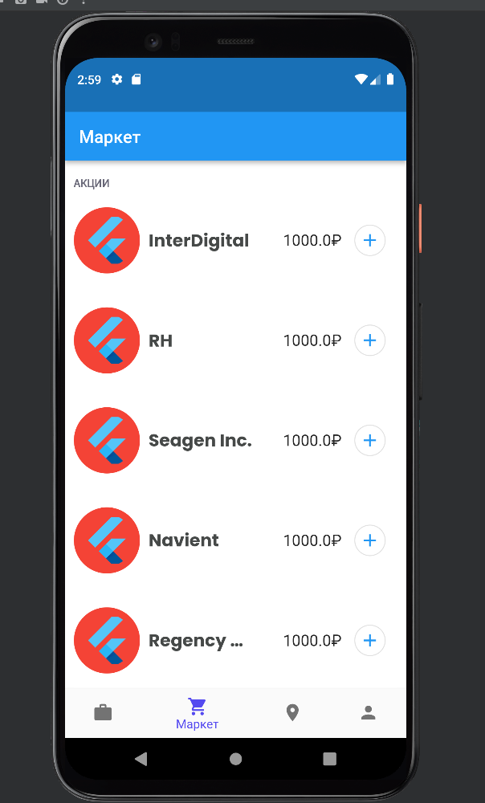
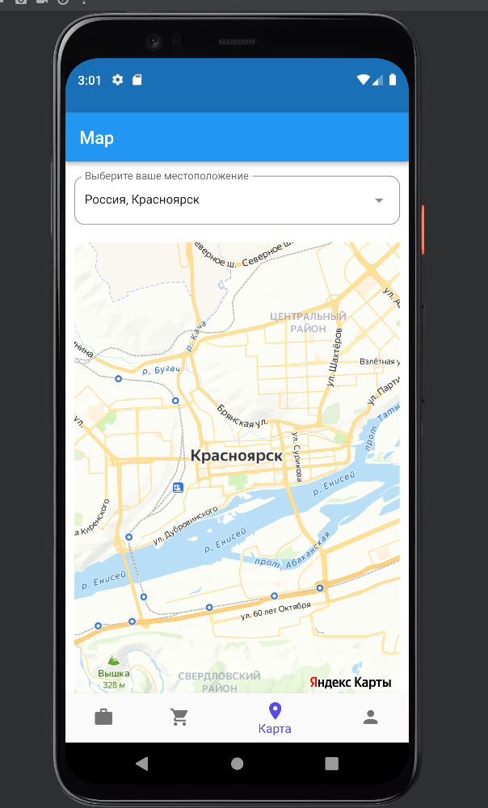

# ToDo Application

## Описание
Это приложение позволяет вам управять вашими финансовыми интсрументами и приобретать/продавать новые. Приложение содержит :
- Страница авторизации;
- Страница регистрации;
- Страница продажи;
- Страница покупки;
- Страница портфолио;
- Страница маркета;
- Страницу карты;
- Страницу профиля.

## Авторизация 

 Для авторизации пользователю необходимо ввести свой электронный адрес и пароль, для регистрации ко всему этому нужно имя.

## Переключение между страницами
Переключение между страницами осуществляется через нижнюю панель.

## Портфолио

На этой странице расположены ваши акции и валюты.

При нажатии на кнопку троеточия возможно продать или купить финансовый инструмент.

После ввода данных нажимаем кнопку "Купить" или "Продать", чтобы осуществить сделку.

## Маркет

Каждый финансовый инструмент маркета имеет свою цену и возможность его покупки через кнопку в правой его части.

## Карта

На карте пользователь отмечает свое местоположение. Когда пользователь начинает вводить данные текстовое поле, ему предлагается выбрать из списка населенные пункты.

## Профиль
В профиле указаны актуальные данные пользователя.

